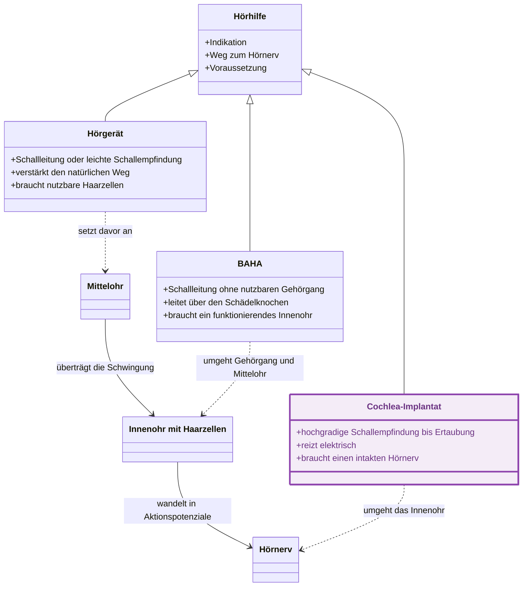

---
tags:
  - contains_AI
source:
  - "[[Vorlesung Audiologie.pdf]]"
---
# Karte
Zeigt, an welcher Station des Hörwegs jede der drei Hörhilfen ansetzt und welche Voraussetzung sie dafür braucht.

`<|-- drei Arten von Hörhilfen`
`--> Weg des Schalls zum Hörnerv`

Je weiter unten am Hörweg ein Gerät ansetzt, desto mehr Stationen überspringt es, und desto weniger vom eigenen Ohr muss noch funktionieren.
## Cochlea-Implantat
Die drei Felder der Klasse aus der Karte, erweitert um das, was jedes für die Entscheidung am Kind bedeutet.

| Feld aus der Karte | Was dahintersteckt | Was es für die Entscheidung am Kind heisst |
|---|---|---|
| hochgradige Schallempfindung bis Ertaubung | beidseits, das Hörgerät bringt zu wenig | früh versorgen, solange die Hörbahn sich bildet |
| reizt elektrisch | Elektrode liegt in der Cochlea und ersetzt die Haarzellen, nicht den Nerv | erklärt, warum ein Hörgerät hier nichts mehr bringt: es verstärkt, wo nichts mehr zu verstärken ist |
| braucht einen intakten Hörnerv | BERA und Bildgebung vor dem Eingriff | ohne Nerv bleibt das Implantat wirkungslos, deshalb steht die Abklärung vor der Zusage |

Die Karte zeigt nicht, wie gut ein Kind nach der Versorgung hört: das hängt am Alter bei der Implantation und an der Nachbetreuung und braucht Verlaufszahlen.
