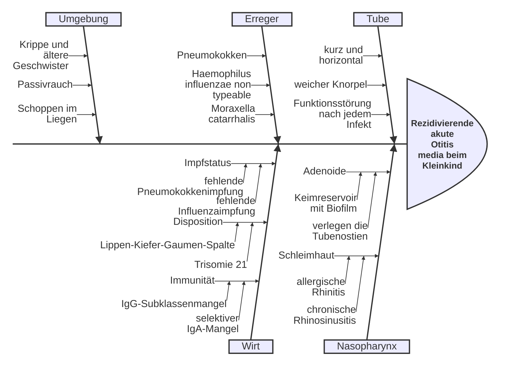
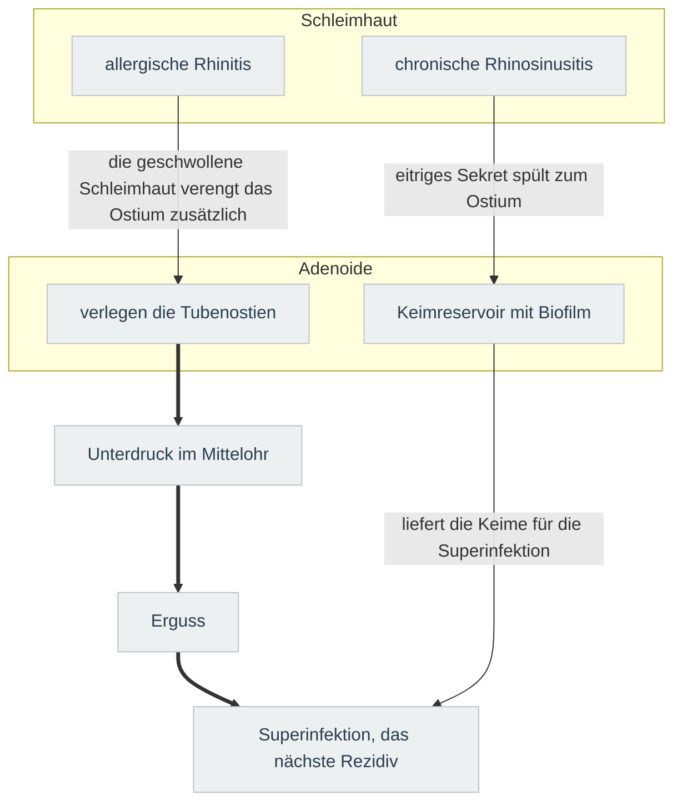

---
tags:
  - contains_AI
source:
  - "[[Vorlesung Mittelohr.pdf]]"
---
# Karte
Zeigt die Bereiche, aus denen die Rezidive einer Otitis media beim Kleinkind kommen, und welche Ursachen in jedem Bereich zusammengehören.

## Tube
Die drei Eigenschaften der Rippe aus der Karte, erweitert um den Vergleich mit dem Erwachsenen: er sagt, warum es das Kleinkind trifft.

| Eigenschaft aus der Karte | Kleinkind | Erwachsener | Folge |
|---|---|---|---|
| kurz und horizontal | Grössenordnung 18 mm und fast waagrecht | Grössenordnung 35 mm und steil nach unten | Keime aus dem Nasopharynx erreichen das Mittelohr leichter und Sekret läuft schlechter ab |
| weicher Knorpel | nachgiebiges Gerüst, die Tube fällt zusammen | stabil, öffnet beim Schlucken zuverlässig | die Belüftung fällt schon bei geringer Schwellung aus |
| Funktionsstörung nach jedem Infekt | mehrere Atemwegsinfekte pro Jahr, jedes Mal geschwollene Schleimhaut | seltener und kürzer | jede Episode hält den Unterdruck aufrecht und bereitet das nächste Rezidiv vor |
## Nasopharynx
Die zwei Gruppen der Rippe aus der Karte, erweitert um das, was sie im Mittelohr auslösen.

`==> Hauptweg zum Rezidiv`

Die Karte zeigt nicht, welcher Bereich am häufigsten den Ausschlag gibt: dazu braucht es Häufigkeitszahlen, die eine Ursachenkarte nicht trägt.
