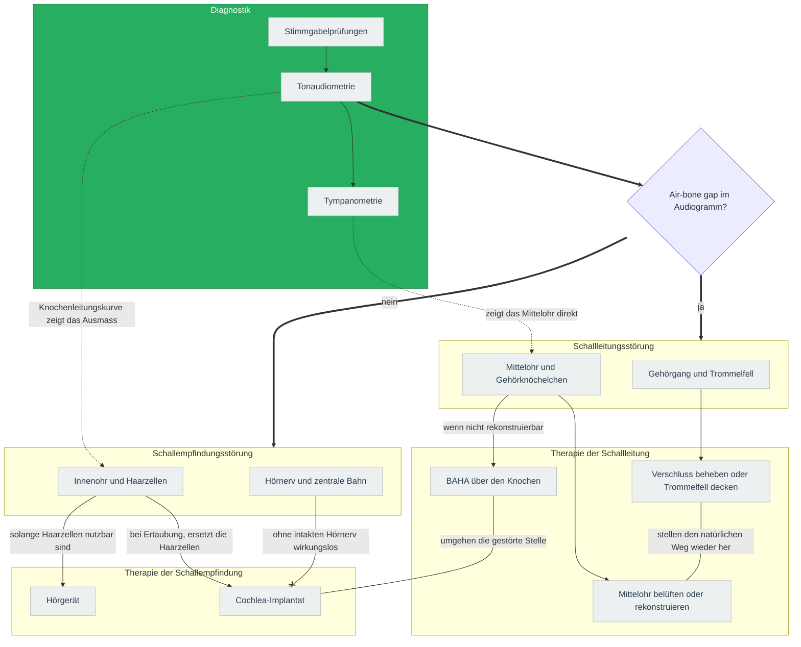
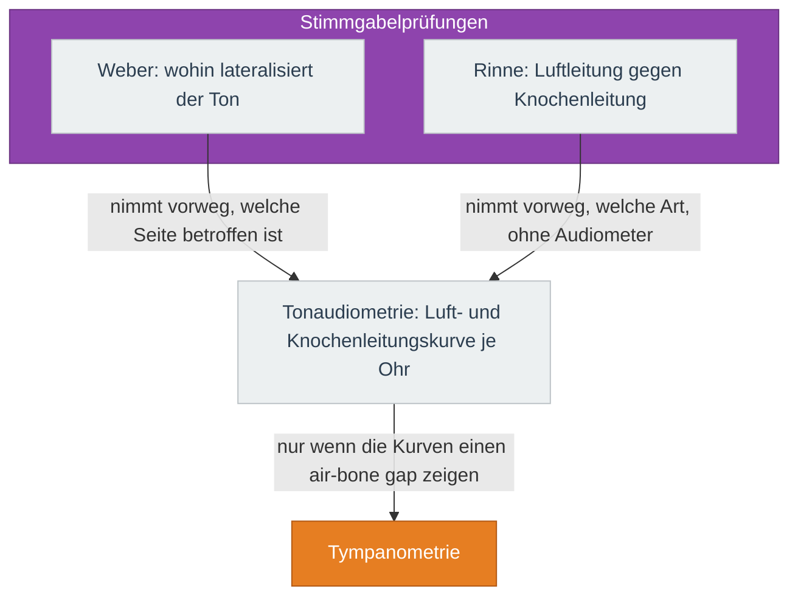
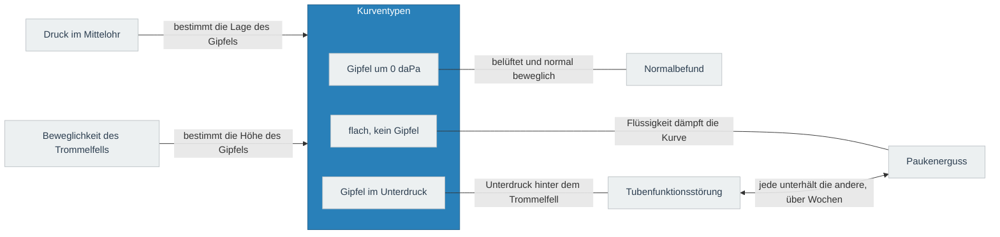
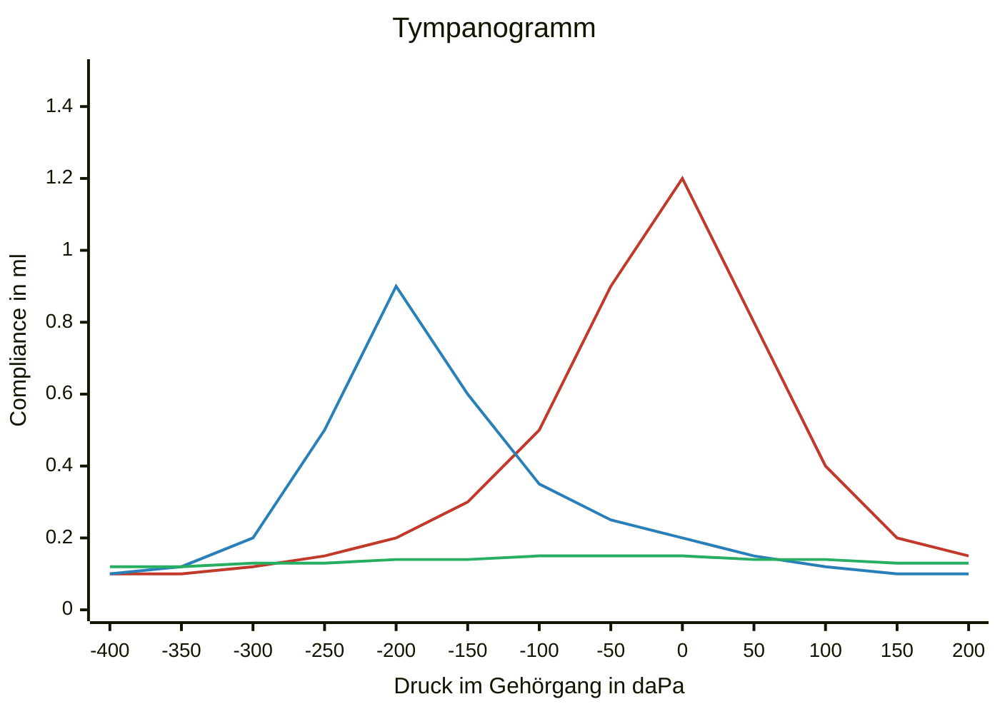

---
tags:
  - contains_AI
source:
  - "[[Vorlesung Audiologie.pdf]]"
---
# Karte
Zeigt, an welchem Ort die zwei Formen der Schwerhörigkeit sitzen, welcher Befund sie trennt und welche Therapie am jeweiligen Ort ansetzt.

`==> Hauptweg der Karte`
`--> was daraus folgt`
## Diagnostik
Die drei Verfahren aus der Karte, erweitert um das, was jedes entscheidet.

### Stimmgabelprüfungen
Die zwei Prüfungen aus der Karte darüber, erweitert um ihren Befund in beiden Formen.

| Prüfung | Schallleitungsstörung | Schallempfindungsstörung | Woran das liegt |
|---|---|---|---|
| Weber, Stimmgabel auf der Stirnmitte | lateralisiert ins kranke Ohr | lateralisiert ins gesunde Ohr | Das blockierte Mittelohr lässt den Knochenschall nicht entweichen, das kranke Innenohr hört ihn schlechter |
| Rinne, Vergleich am kranken Ohr | negativ: Knochenleitung besser als Luftleitung | positiv: Luftleitung bleibt besser, beide abgesenkt | Die Luftleitung verliert die Mittelohrübertragung, die Knochenleitung umgeht sie |

Bei beidseitig gleichem Verlust sagt der Weber nichts: er braucht die Seitendifferenz.
### Tympanometrie
Die Tympanometrie aus der Karte darüber, aufgeklappt in die zwei Grössen, die sie misst, und die Zustände, die hinter jedem Kurventyp stehen.

#### Kurventypen
Die drei Kurvenformen aus der Karte darüber, erst als Messschrieb mit den zwei Grössen auf den Achsen, dann als Typenliste mit Zustand und Ursache.

▬ Gipfel um 0 daPa
▬ Gipfel im Unterdruck
▬ flach, kein Gipfel

| Kurve | Typ | Zustand des Mittelohrs | Typische Ursache |
|---|---|---|---|
| Gipfel um 0 daPa, normale Höhe | A | belüftet, normal beweglich | Normalbefund |
| Gipfel um 0 daPa, flach | As | versteift | Otosklerose, Tympanosklerose |
| Gipfel um 0 daPa, überhöht | Ad | zu nachgiebig | unterbrochene Gehörknöchelchenkette, atrophes Trommelfell |
| Gipfel im Unterdruck | C | Unterdruck hinter dem Trommelfell | Tubenfunktionsstörung |
| flach, kein Gipfel | B | Flüssigkeit, oder offene Verbindung nach aussen | Paukenerguss, bei grossem Gehörgangsvolumen Perforation |
# Die zwei Formen im Vergleich
| | Schallleitungsstörung | Schallempfindungsstörung |
|---|---|---|
| Audiogramm | Knochenleitung normal, Luftleitung abgesenkt | beide Kurven abgesenkt, kein Abstand |
| Typische Ursachen | Cerumen, Paukenerguss, Perforation, Otosklerose, Atresie | Presbyakusis, Lärm, konnatale Infektion, nach Meningitis, Vestibularisschwannom |
| Grenze des Verlusts | endlich, die Knochenleitung bleibt | bis zur Ertaubung möglich |
