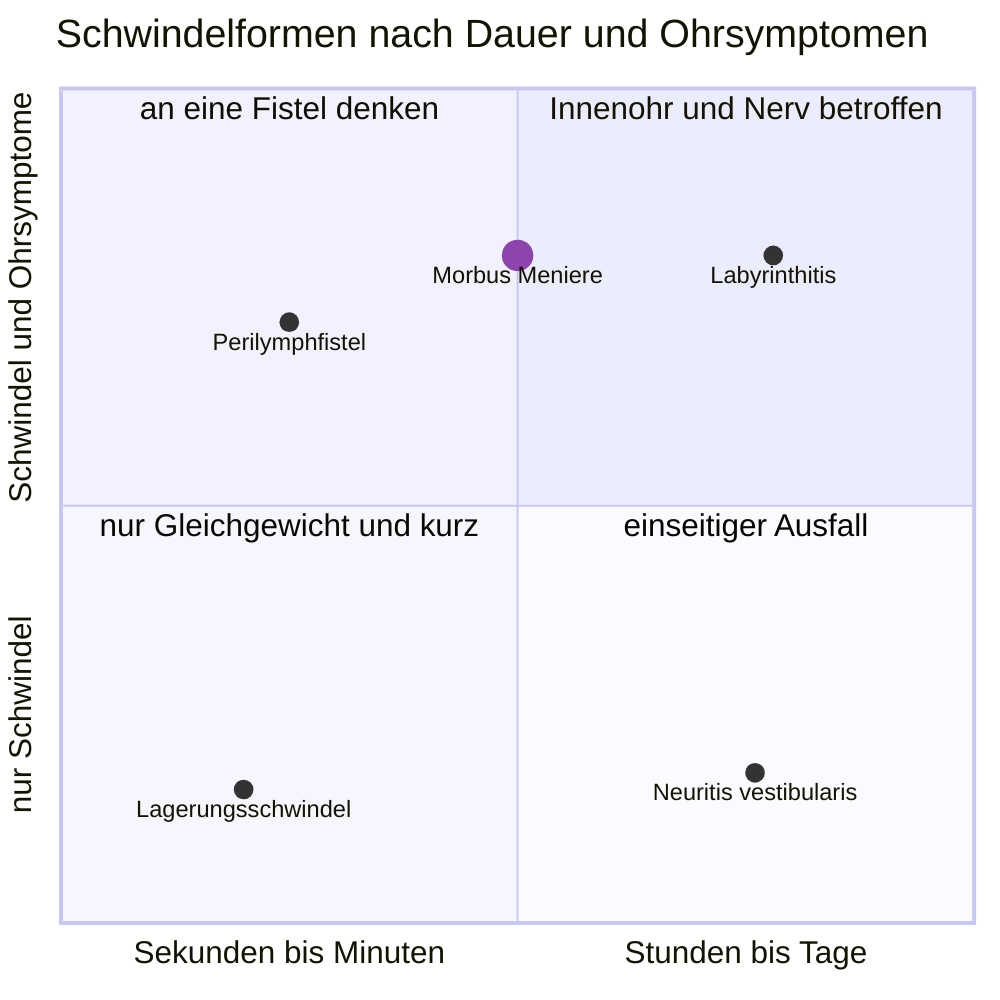

---
tags:
  - contains_AI
source:
  - "[[Vorlesung Vestibularis.pdf]]"
---
# Karte
Zeigt, wie zwei Fragen aus der Anamnese die Schwindelformen trennen: wie lange die Attacke dauert und ob das Hören mitbetroffen ist.

## Morbus Meniere
Der Punkt aus der Karte, aufgeklappt in die drei Beschwerden und das, was mit jeder über die Jahre geschieht.

| Beschwerde | im Anfall | zwischen den Anfällen | nach Jahren |
|---|---|---|---|
| Schwindel | Drehschwindel über Minuten bis Stunden, mit Übelkeit | beschwerdefrei oder leicht unsicher | seltenere Anfälle, dafür bleibende Unsicherheit |
| Hören | Tieftonverlust auf der betroffenen Seite | erholt sich anfangs vollständig | bleibender Verlust, auch in den hohen Frequenzen |
| Tinnitus und Druckgefühl | tieffrequent, das Ohr fühlt sich zu | oft leiser, verschwindet selten ganz | dauerhaft |

Die Karte zeigt nicht, in welchen Abständen die Anfälle wiederkehren: sie schwanken zwischen Wochen und Jahren und lassen sich aus einer Momentaufnahme nicht ablesen.
