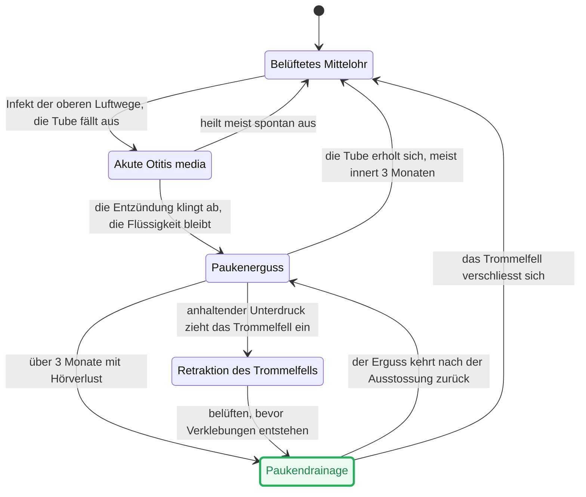
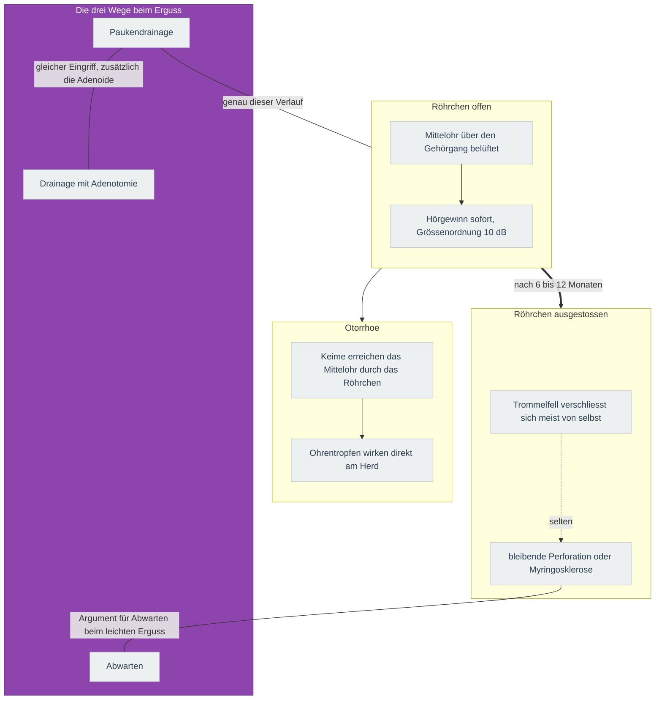

---
tags:
  - contains_AI
source:
  - "[[Vorlesung Mittelohr.pdf]]"
---
# Karte
Zeigt, welche Zustände ein Mittelohr durchläuft und auf welchen Wegen es in einen früheren zurückkehrt.

## Paukendrainage
Der Zustand aus der Karte, aufgeklappt in die drei Zustände des Röhrchens, mit dem, was in jedem passiert und woran die Indikation hängt.

`==> Hauptverlauf des Röhrchens`
`--> was daraus folgt`
### Die drei Wege beim Erguss
Die drei Wege aus der Karte darüber, erweitert um das, was sie unterscheidet.

| Weg | Hören kurzfristig | Wiederkehr | Belastung |
|---|---|---|---|
| Abwarten | bleibt eingeschränkt | der Erguss geht in der Mehrzahl innert 3 Monaten von selbst zurück | keine Narkose |
| Paukendrainage | Gewinn sofort, Grössenordnung 10 dB | der Erguss kann nach der Ausstossung wiederkehren | Narkose, Otorrhoe möglich |
| Drainage mit Adenotomie | gleicher Gewinn | seltener ein zweiter Eingriff nötig, vor allem bei älteren Kindern | grösserer Eingriff, Nachblutungsrisiko |

Die Karte zeigt nicht, wie lange der Hörgewinn anhält: dazu braucht es Verlaufszahlen, die eine Momentaufnahme nicht trägt.
